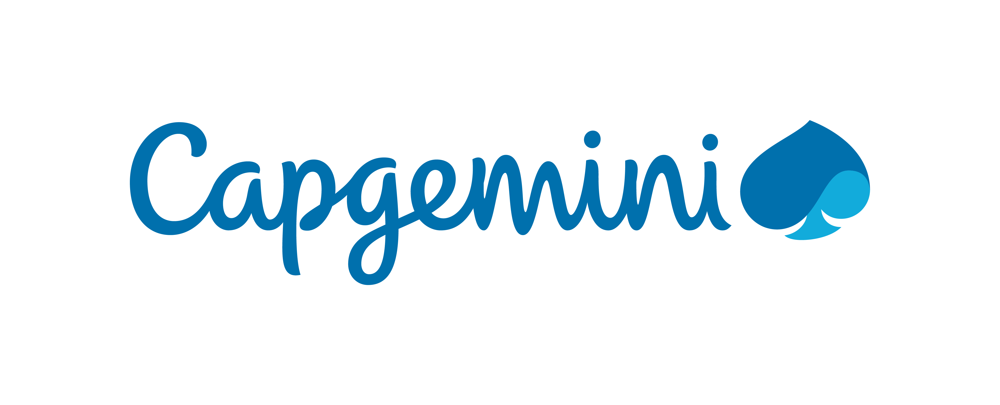

# Purpose 

The team has asked that you prepare a 20 to 30-minute presentation (in this notebook) on one of the topics from below. The purpose of this
exercise is to demonstrate your ability to draw insights from data, put
insights in business-friendly format and confirm coding knowledge. These
topics are similar in nature to projects we run. Please make sure that
your presentation is accessible to a general technical audience (aside from the sections of code, of course). 

# Data 

**Sales Forecasting 
**

Build and evaluate models to predict national retail store sales for
each store and department. Our sales are very seasonal, and we make
our money during holidays like Super Bowl, Labor Day, Thanksgiving,
and Christmas. The data is contained in `sales_forcasting.csv`

# Deliverables 
Your notebook should contain:

1.  Description of the problem; state what you are solving/ analyzing
2.  Presentation of insights/conclusion you generate
3.  Relevant descriptive statistics (charts, graphs, etc.) 
4.  Specification of predictive model (mathematical formulation)
5.  Relevant model diagnostics
6.  Model interpretation (what do the coefficients mean, how do you use
    them?)
7.  Please specify language, packages and libraries used to develop your
    solution

# Evaluation Criteria 

- Presentation on analysis conducted that covers business outcomes and statistical methodologies
- Preform exploratory data analysis to gather starting insights and conclusions
- Selection of ML/Predictive modeling technique(s) & feature extraction
- Knowledge with data ingestion tools/languages
- Ability to conduct appropriate data cleansing if any
- Ability to code in open source languages

# Rules 

- Use any open source language of your choice

- Solution you provide should be your own. Reference any material desired.

- Be prepared to discuss your code in-depth (what it does, how it does it etc.)

- Utilize any statistical or ML technique(s) you deem relevant. For
each technique that you use, be prepared to talk about model
diagnostics, results, and mathematics behind your technique(s).

- No time limit on developing your solution. Let us know when you are ready.
