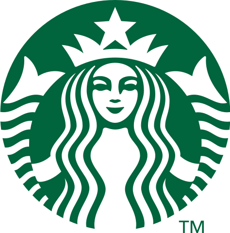

# Starbucks Analysis

## Data
The data for this exercise consists of about 120,000 data points split in a 2:1 ratio among training and test files. In the experiment simulated by the data, an advertising promotion was tested to see if it would bring more customers to purchase a specific product priced at $10. Since it costs the company 0.15 to send out each promotion, it would be best to limit that promotion only to those that are most receptive to the promotion. Each data point includes one column indicating whether or not an individual was sent a promotion for the product, and one column indicating whether or not that individual eventually purchased that product. Each individual also has seven additional features associated with them, which are provided abstractly as V1-V7.

## Task
The task is to use the training data (`training.csv`) to understand what patterns in V1-V7 to indicate that a promotion should be provided to a user. Specifically, the goal is to maximize the following two metrics:
-  Incremental Response Rate (IRR), which is the difference between a ratio of the number of purchasers in the treatment group and a ratio of the number of purchasers in the control group.
- Net Incremental Revenue, which is the revenue made or lost by sending out the promotion

Essentially, to maximize both of these metrics, we want to send users the treatment (`promotion`) only if they
would not have purchased otherwise.

Testing data is included in `testing.csv`
